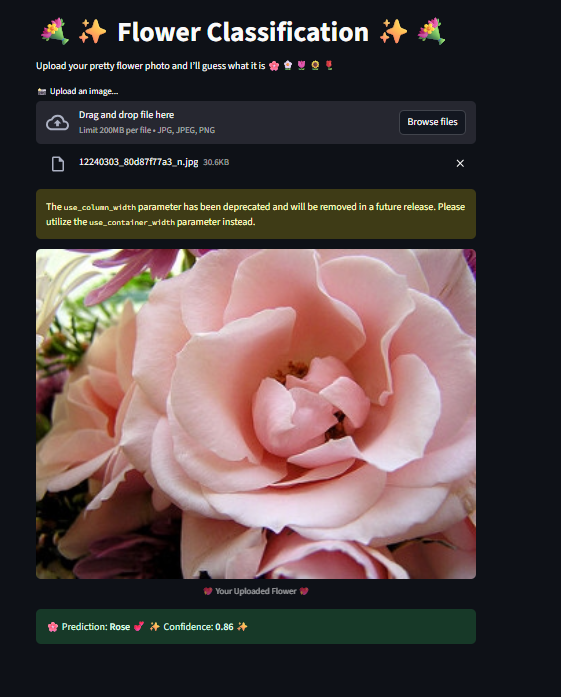

# 🌸 Flower Classification App

This is a **Streamlit web app** that uses a trained deep learning model (`myModel.keras`) to classify flowers into different types.  
Upload a flower photo and the model will predict which type it belongs to.  

---

## 🚀 Features
- Upload any flower image (`.jpg`, `.jpeg`, `.png`).
- Model predicts the flower type with confidence score.
- Cute, girly pastel-themed UI 🌷✨.
- Built with **TensorFlow** and **Streamlit**.

---

## 🖼️ Demo
Here’s a preview of the app:




---

## 📦 Installation

Clone this repo and install the required packages inside a virtual environment:

```bash
git clone https://github.com/your-username/flower-classification-app.git
cd flower-classification-app

python -m venv venv
source venv/bin/activate   # On Linux/Mac
venv\Scripts\activate      # On Windows

pip install -r requirements.txt

